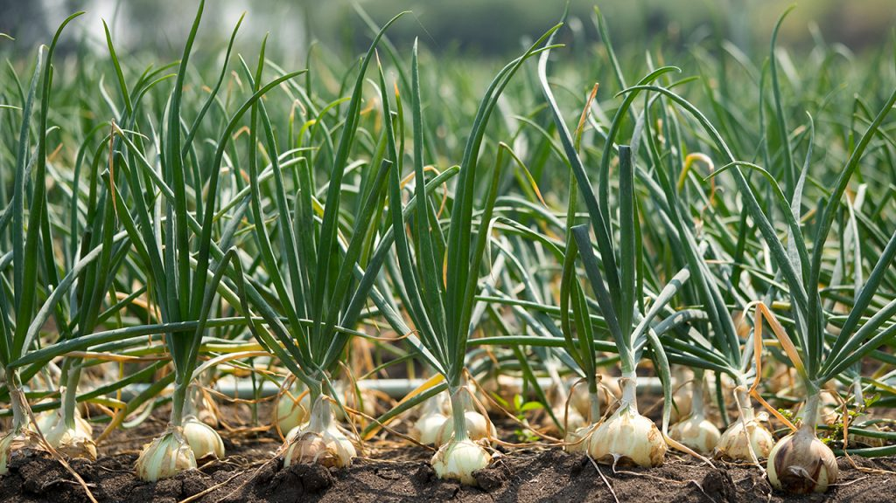
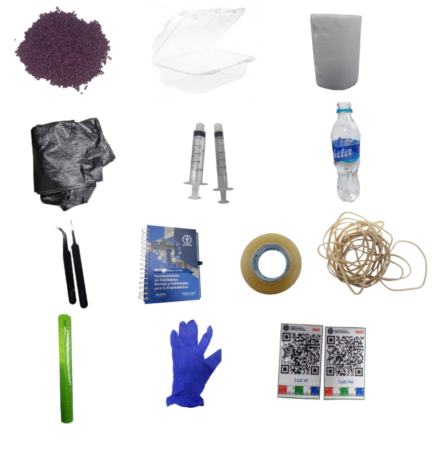
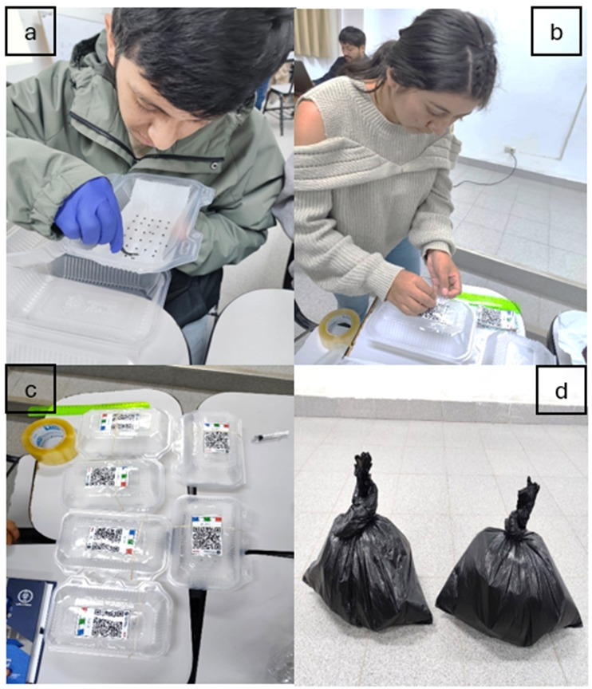
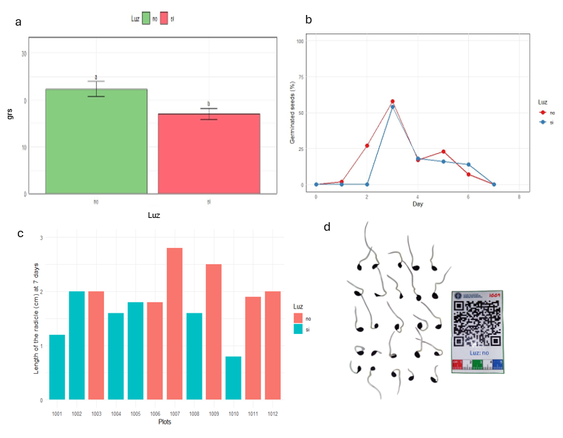

# Introducción

La cebolla (*Allium cepa* L.) es una hortaliza de gran importancia socioeconómica a nivel mundial, ocupando el segundo lugar en producción global, con más de 99 millones de toneladas en más de 5 millones de hectáreas (Imran et al., 2025). Además de su valor culinario, posee propiedades funcionales debido a su contenido de flavonoides, compuestos azufrados, vitaminas A y C, y minerales con actividad antioxidante (Muscolo et al., 2025). Por ello, la obtención de plántulas vigorosas a partir de semillas de alta calidad es clave, ya que la germinación determina la densidad de establecimiento y la uniformidad del cultivo (Taylor, 2003). La germinación es un proceso fisiológico regulado por factores ambientales como temperatura, agua y luz. En semillas de cebolla, la germinación óptima ocurre entre 10 y 30 °C, con mayor vigor a 25 °C en oscuridad, mientras que condiciones extremas la reducen significativamente (Abu-Rayyan et al., 2012). Asimismo, la luz puede inhibir este proceso, favoreciendo plántulas anormales, fenómeno asociado al fotoblatismo negativo, donde la germinación se favorece en ausencia de luz (Bewley & Black, 2012; Renard, 1989). El experimento evaluó el efecto de la luz en la germinación de semillas de cebolla , bajo la hipótesis de diferencias significativas en el tiempo y porcentaje de germinación. Se empleó un diseño completamente al azar con dos tratamientos con ( luz: si y luz no), seis repeticiones y registro de germinación acumulada durante seis días. Los datos fueron registrados en Tarpuy y analizados con el paquete GerminaR en R. Asimismo se planteó como objetivos. Evaluar el efecto de la presencia y ausencia de luz sobre el porcentaje de germinación de semillas de cebolla (*Allium cepa* L.). y comparar el tamaño de la radícula de las plántulas a los siete días bajo condiciones de luz y sin luz.

{fig-align="left" width="1000"}

# Materiales y métodos

Para llevar a cabo el experimento se empleó lo siguiente:

## Materiales

-   Semilla de cebolla *(Allium cepa L)*.
-   Taper de plastico
-   Papel
-   toalla
-   Bolsa negra
-   Jeringa
-   Agua mineral
-   Pinzas
-   Cuaderno/Lápiz.
-   Cinta scotch
-   Ligas Regla
-   Guantes de latex
-   Etiquetas

{fig-align="center"}

*Figura 1. Materiales*

## Métodos

### Desarrollo del experimento

El procedimiento experimental consistió en poner el papel toalla dentro de los tapers y humedecer con agua haciendo uso de la jeringa, sobre el cual se colocaron 25 semillas de cebolla por recipiente, distribuidas de manera uniforme con ayuda de las pinzas y evitando el contacto directo entre las semillas. Para el tratamiento sin luz (ntreat = 2), los seis recipientes fueron cubiertos herméticamente con bolsas negras, asegurados con las ligas para impedir el ingreso de luz. El tratamiento con luz (ntreat= 1) se mantuvo descubierto bajo iluminación ambiental.

{fig-align="center" width="454"}

*Figura 2. a) Colocación de las 25 semillas en cada taper; b) Etiquetado; c) Tratamientos con luz; d) Tratamientos sin luz*

Ambos tratamientos permanecieron a temperatura ambiente durante todo el periodo experimental. La humedad fue repuesta solo en caso si fuera necesario. A partir del día 0 y hasta el día 7, se registró diariamente el número de semillas germinadas nuevas por recipiente, contabilizando como germinada aquella semilla que presentó radícula visible de longitud mayor a 2mm. Los valores registrados en la tabla de google sheet (fb) corresponden a la germinación diaria más no al acumulado.

# Resultados y discusiones

## Resultados

*Figura 3. a) Semillas germinadas con luz y sin luz  ; b) El porcentaje de germinación durante los siete días de evaluación; c) El tamaño de la radícula en cm de todos los plots ; d) Germinación de tratamientos a los siete días.*

## Discusiones

La germinación de Allium cepa L. evidenció diferencias entre tratamientos, donde la ausencia de luz favoreció una respuesta más uniforme y ligeramente superior en el porcentaje de germinación. Aunque ambos tratamientos alcanzaron su máximo alrededor del tercer día, las semillas en oscuridad mostraron una activación fisiológica más eficiente. Este comportamiento coincide con lo reportado por Abu-Rayyan et al. (2012), quienes señalan que la germinación de cebolla se optimiza bajo condiciones de baja exposición lumínica. Asimismo, Bewley y Black (2012) explican que en especies con fotoblastismo negativo la luz puede actuar como un factor inhibidor, interfiriendo en los procesos metabólicos necesarios para la germinación.

En cuanto al crecimiento de la radícula, las plántulas desarrolladas en oscuridad presentaron mayor longitud en comparación con aquellas expuestas a la luz, lo que indica un mayor vigor inicial. Este resultado puede explicarse por la estimulación de la elongación celular en ausencia de luz, fenómeno asociado a respuestas adaptativas de las plántulas. Según Renard (1989), la oscuridad favorece el crecimiento inicial en Allium cepa, promoviendo una mayor elongación de las estructuras embrionarias. En contraste, la luz tiende a regular el crecimiento, limitando la elongación radicular en etapas tempranas, lo cual coincide con los resultados observados en este estudio.

# Conclusiones

En respuesta al objetivo 1. Se determinó que la ausencia de luz favorece el porcentaje de germinación de semillas de (*Allium cepa* L)., cumpliendo el primer objetivo del estudio, ya que las semillas en oscuridad presentaron una germinación más uniforme y eficiente en comparación con aquellas expuestas a la luz. Asimismo, en relación con el segundo objetivo, se evidenció que las plántulas desarrolladas en ausencia de luz alcanzaron un mayor tamaño de radícula a los siete días, lo que indica un mayor vigor inicial. En conjunto, la oscuridad se establece como una condición favorable tanto para la germinación como para el crecimiento inicial de la cebolla (*Allium cepa.* L*)*.

# Referencias bibliográficas

Abu-Rayyan, A., Akash, M. W., & Gianquinto, G. (2012). Onion Seed Germination as Affected by Temperature and Light. International Journal of Vegetable Science, 18(1), 49-63. https://doi.org/10.1080/19315260.2011.570419

Bewley, J. D., & Black, M. (2012). Physiology and Biochemistry of Seeds in Relation to Germination: Volume 2: Viability, Dormancy, and Environmental Control. Springer Science & Business Media.

Imran, M., Kang, H., Lee, S.-G., Kim, E.-H., Park, H.-M., & Oh, S.-W. (2025). Current Trends and Future Prospects in Onion Production, Supply, and Demand in South Korea: A Comprehensive Review. Sustainability, 17(3), 837. https://doi.org/10.3390/su17030837

Muscolo, A., Maffia, A., Marra, F., Battaglia, S., Oliva, M., Mallamaci, C., & Russo, M. (2025). Unlocking the Health Secrets of Onions: Investigating the Phytochemical Power and Beneficial Properties of Different Varieties and Their Parts. Molecules, 30(8), 1758. https://doi.org/10.3390/molecules30081758

Renard, H. A. (1989). INFLUENCES OF LIGHT ON THE GERMINATION AND FIRST GROWTH IN TWO VEGETABLE SPECIES: ALLIUM CEPA AND RAPHANUS SATIVUS. Acta Horticulturae, (253), 187-202. https://doi.org/10.17660/ActaHortic.1989.253.20

Taylor, A. G. (2003). SEED DEVELOPMENT \| Seed Quality. 1285-1291. https://doi.org/10.1016/B0-12-227050-9/00056-9
